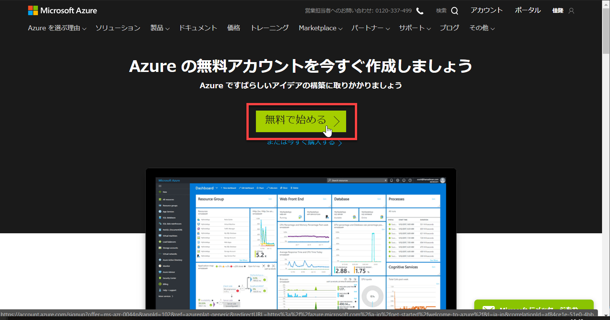

# Microsoft Azure サブスクリプションを用意する

ハンズオンのこの後の手順で、Cognitive Services の Translator Text を利用します。 
Translator Text を利用するには **Azure サブスクリプション** が必要です。  

すでに Azure サブスクリプションをお持ちの場合は、この手順は不要です。 
[**Translator Text と Text Analytics を使って翻訳アプリを作成する**](04_TranslatorApp.md) に進んでください。

---

## Azure サブスクリプションを持っていない場合

1. [Azure の無料アカウント作成ページ](https://azure.microsoft.com/ja-jp/free/) にアクセスします。 

2. **無料で始める** をクリックします。 
今後も継続して Azure を利用する予定ならば、**または今すぐ購入する** を選択してもかまいません。

3. **自分の情報** を入力します。
4. **電話による本人確認** を入力します。 
SMS または音声で確認コードを受け取ります。
5. **カードによる本人確認** を入力します。
6. **アグリーメント** を入力します。

以上で、Azure サブスクリプションの無料アカウントが用意できました。 
ハンズオンの範囲では Translator Text リソース (およびハンズオンで利用する Text Analytics リソース) は無料プランで十分です。 
Azure サブスクリプションのクレジットは他の用途にも活用してください。