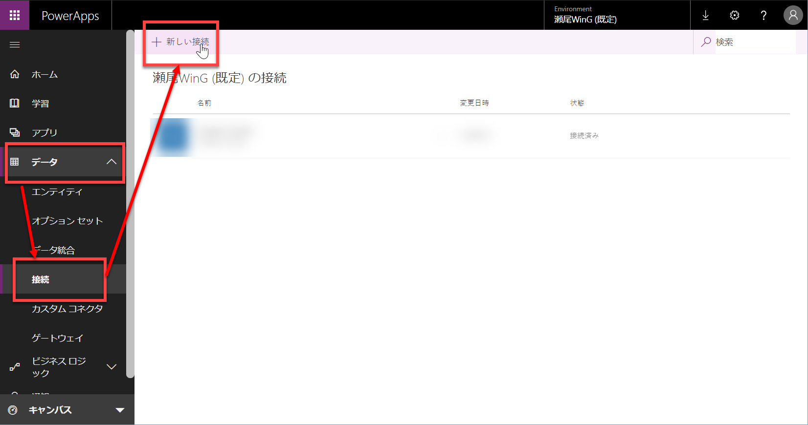
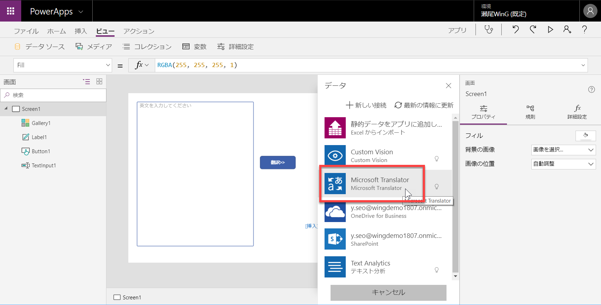
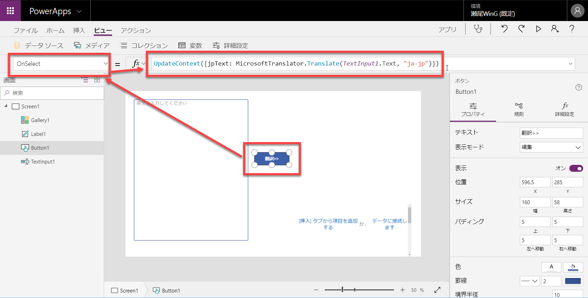
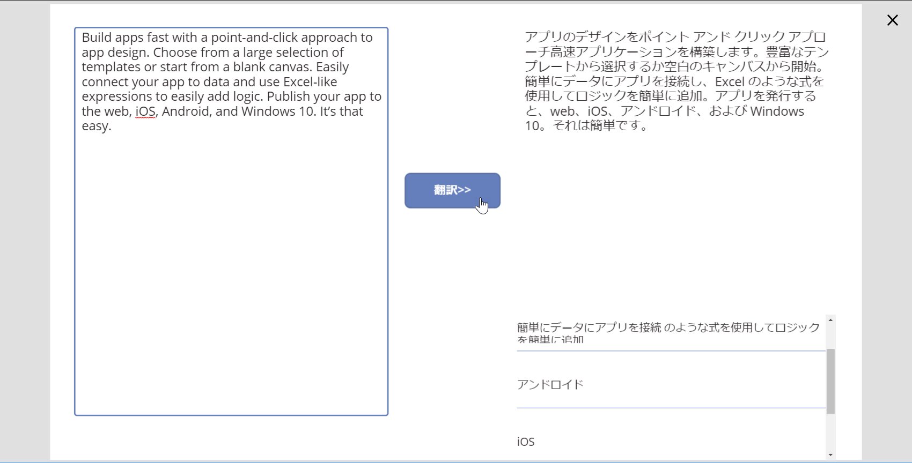

# Translator Text と Text Analytics を使って翻訳アプリを作成する

このハンズオンでは、[Cognitive Services](https://azure.microsoft.com/ja-jp/services/cognitive-services/) の [**Text Translator**](https://azure.microsoft.com/ja-jp/services/cognitive-services/translator-text-api/) および [**Text Analytics**](https://azure.microsoft.com/ja-jp/services/cognitive-services/text-analytics/) を利用して翻訳アプリケーションを作ります。


[別のハンズオン（Custom vision を利用する PowerApps アプリ）](https://github.com/seosoft/CognitiveWorkshop/blob/master/04_PowerApps.md) では、オンラインのサービス (Custom Vision) に接続するアプリケーションを開発しました。  
ここでは、連続して複数のサービスを利用して、かつ画面がもう少し複雑な PowerApps アプリを開発してみます。

---

## Text Analytics のアクセスキー取得

1. [**Text Analytics のアクセスキー取得ページ**](https://azure.microsoft.com/ja-jp/try/cognitive-services/my-apis/?api=text-analytics) を開き、**追加** をクリックします。

    

1. 取得した Endpoint および Key1 をメモ帳などに貼り付けておきます。

    

    同じアカウントで以前にも無償のキーを取得したことがある場合は、上記の手順では新しいキーを取得できません。また上記の手順で取得したアクセスキーは利用可能な期間が短いものです。  
キーを取得できない場合、または継続して利用したい場合は、お持ちの Azure サブスクリプション、または [無償の Azure アカウント](https://azure.microsoft.com/ja-jp/free/) を取得した上で、Text Analytics API のリソースを取得してください。

Azure サブスクリプションで Text Analytics API リソースを作成する場合は、以下の手順で操作します。

1. Azure ポータル画面で、**リソースの作成** を選択し、検索ボックスに **Text Analytics** などと入力します。

    候補が少なくなったら、**Text Analytics API** を選択します。

    

2. Text Analytics API の情報を入力します。

    

3. Text Analytics API が作成されたら、メニューの **Overview** を選択して **Endpoint** をメモ帳などに貼り付けておきます。

    

5. メニューの **Keys** を選択して、**KEY 1** をメモ帳に貼り付けておきます。

    

---

## PowerApps に接続の追加

PowerApps で、Text Analytics、および Translator Text (こちらはアクセスキーの取得が不要) への接続を追加します。

1. [PowerApps](https://web.powerapps.com/) にサインインします。
2. メニューの **データ** - **接続** を選択して、**新しい接続** をクリックします。

    

3. 検索ボックスに **テキスト分析** と入力して、リストに表示されたテキスト分析への接続を選択します。

    

4. Text Analytics の設定ウィンドウが開いたら、先ほどメモ帳などの記録しておいたアクセスキー、URL を貼り付けて、**保存** をクリックします。

    

5. Translator Text への接続のために、もう一度 **新しい接続** をクリックして、検索ボックスに **Translator** などと入力します。
6. リストの **Microsoft Translator** をクリックします。こちらはアクセスキーの設定などは不要です。

    

以上で、接続の設定は完了です。  
続いて、翻訳アプリの開発に入ります。

---

## 新しいアプリの開発

1. メニューの **アプリ** を選択して、**アプリの作成** をクリックします。

    

2. **空のアプリ** の **タブレットレイアウト** を選択します。

    前のステップの [画像解析アプリ](https://github.com/seosoft/CognitiveWorkshop/blob/master/04_PowerApps.md) では "携帯電話レイアウト" を使用しましたが、今回は "**タブレットレイアウト**" にします。

    

3. PowerApps アプリのデザイン画面が開きます。

    

---

## アプリの設定

1. PowerApps アプリのデザイン画面で **ファイル** を選択します。

    

2. アプリ名、アイコンの背景色、アイコンを任意に設定します。

    

3. **名前を付けて保存** を選択して、**保存** をクリックします。

    

4. アプリのデザイン画面に戻ります。

    保存に成功したら、左上の ← (Web ブラウザーの戻るボタンではありません) をクリックして、デザイン画面に戻ります。

---

## 画面のデザイン

コントロールを配置して、画面をデザインします。

今回は 4個のコントロールを配置します。配置の状態は以下のようになります。


- テキスト入力
- ボタン
- ラベル
- ギャラリー (縦方向(空))

以下、順番に配置して、プロパティを変更していきます。

1. テキスト入力を配置します。

    **挿入** - **テキスト** - **テキスト入力** を選択します。

    

2. テキスト入力のプロパティを設定します。

    - 位置、サイズ・・・適当に
    - 既定・・・既定の文字列を削除
    - ヒントのテキスト・・・英文を入力してください
    - モード・・・複数行
    - Size ・・・適当な数値に（デフォルト値だと文字が小さすぎるようであれば変更）

    

3. ボタンを配置します。

    **挿入** - **ボタン** を選択します。

4. ボタンのプロパティを設定します。

    - 位置、サイズ・・・適当に
    - テキスト・・・"翻訳>>" など

    

5. ラベルを配置します。

    **挿入** - **ラベル** を選択します。

6. ラベルのプロパティを設定します。

    - 位置、サイズ・・・適当に
    - テキスト・・・既定の文字列を削除
    - オーバーフロー・・・スクロール
    - Size ・・・適当な数値に（デフォルト値だと文字が小さすぎるようであれば変更）

    

7. ギャラリーを配置します。

    **挿入** - **ギャラリー** - **縦方向(空)** を選択します。

    

8. ギャラリーのプロパティを一部設定します。

    - 位置、サイズ・・・適当に

    その他のプロパティは、あとで改めて設定します。ここでは位置、サイズのみ設定します。

---

## Translator Text 呼び出し（翻訳機能の実装）

ボタンクリックで、テキスト入力内の英文を翻訳する機能を実装します。  
Translator Text (PowerApps の接続名では Microsoft Translator) を呼び出すことで実現します。

1. ボタンにデータソースを接続します。

    ボタンを選択して、メニューの **ビュー** - **データソース** を選択します。  

    

2. **データソースの追加** をクリックします。

    

3. **Microsoft Translator** を選択します。

    Translator が **データペイン** に表示されれば、**x** で閉じてかまいません。

    
    

4. ボタンをクリックした時の動作を設定します。

    ボタンを選択して、プロパティ選択で **OnSelect** を選択します。  
    続いて、プロパティ値として以下を入力します。

    ```
    UpdateContext({jpText: MicrosoftTranslator.Translate(TextInput1.Text, "ja-jp")})
    ```

    内部の **MicrosoftTranslator.Translate(TextInput1.Text, "ja-jp")** の部分は、テキスト入力に入れた英文を日本語 (ja-jp) に翻訳することを意味します。  
    UpdateContext の部分は、日本語に翻訳した結果を jpText という変数に代入することを意味します。

    

5. 翻訳結果をラベルに表示します。

    ラベルを選択して、プロパティとして **Text** を選択します。  
    プロパティ値は **jpText** を設定します。

    

6. プレビュー実行してみます。

    **プレビュー実行** をクリック、または **F5 キー** で、プレビュー実行します。  
    何か英文を入力してから翻訳ボタンをクリックすると、日本語訳が表示されます。

    

    プレビュー実行に成功したら、**×** をクリックして、プレビューを閉じます。

---

## キーフレーズの取得と表示

日本語への翻訳機能に続いて、翻訳文の大事な語句を取得する機能を追加してみます。

1. データソースを追加します。

    先ほど Translator を追加したのと同じ手順で、**テキスト分析** (Text Analytics の PowerApps での呼び方)) を追加します。  
    ボタンを選択して、メニューの **ビュー** - **データソース** を選択します。  
    **データソースの追加** をクリックしたら、リストから **テキスト分析** を追加します。

    
    

2. ボタンを選択して、プロパティとして **OnSelect** を選択します。
3. プロパティ値として以下を入力します。

    先ほどの手順では 1行だけでしたが、今回は 2行にします。  
    （以下の2行を追加するのではなくて、すべて置換します）

    ```
    UpdateContext({jpText: MicrosoftTranslator.Translate(TextInput1.Text, "ja-jp")});  
    UpdateContext({keyphrases: テキスト分析.KeyPhrases({text: jpText}).keyPhrases})
    ```

    2行目は、翻訳された日本語 (jp.Text) の内容をテキスト分析に渡して、キーフレーズとして返ってきた結果を keyphrases 変数に代入します。

    

4. キーフレーズをギャラリーに渡します。

    ギャラリーを選択して（ギャラリー内の要素ではなく、ギャラリー全体を選択します。画面左側のコントロールツリーで **Gallery1** が選択されていれば、正しく選択できています）  
    その状態で、プロパティ選択で **Items** を選択し、プロパティ値として **keyphrases** を設定します。

    

5. ギャラリーのフィールドを変更します。

    ギャラリー (Gallery1) が選択された状態で、画面右側にある **フィールド** をクリックします。  
    レイアウトとして **タイトル** を、Title1 では **Value** を選択します。

    
    

6. 今回のアプリでは、ギャラリー要素の **>** は不要なので削除します。

    左側のコントロールツリーで **NextArrow1** の **...** をクリックして、**削除** を選択します。

    

7. ギャラリーのレイアウトを調整します。

    ギャラリー要素の **Title1** および **Separator1** の位置とサイズを適当に変更して、レイアウトを調整します。

    

8. ギャラリーのフォントを調整します。

    実際に実行してみると、ギャラリーのフォントが大きく、また太字になっているため、見た目を調整します。  
    左側のコントロールツリーで **Title1** を選択してから、メニューの **ホーム** を選択します。続いて、**フォントサイズ**、**フォントの太さ** を適当に設定します。

    

---

## プレビュー実行

プレビュー実行して、動作を確認してみます。



以上で、翻訳アプリは完成です。  
