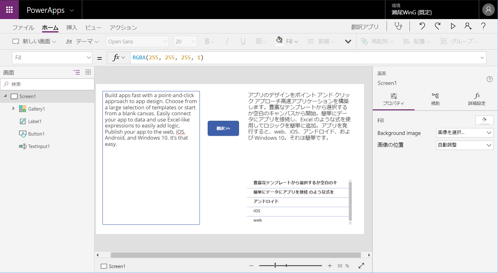

# Translator Text と Text Analytics を使って翻訳アプリを作成する

このハンズオンでは、[Cognitive Services](https://azure.microsoft.com/ja-jp/services/cognitive-services/) の [**Text Translator**](https://azure.microsoft.com/ja-jp/services/cognitive-services/translator-text-api/) および [**Text Analytics**](https://azure.microsoft.com/ja-jp/services/cognitive-services/text-analytics/) を利用して翻訳アプリケーションを作ります。

