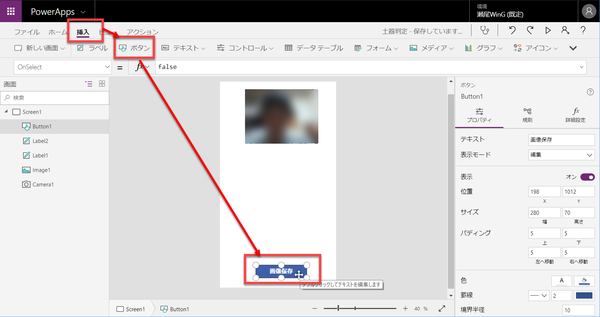
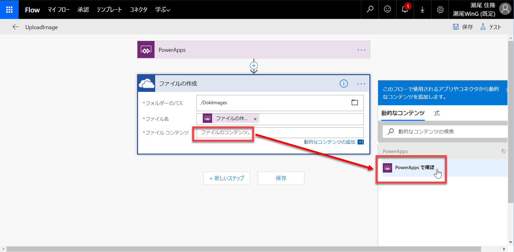

# Flow で PowerApps の機能を拡張する

[**Flow**](https://japan.flow.microsoft.com/ja-jp/) は、PowerApps のデザイン画面だけでは実現できないような機能を追加する際に使用する機能です。  
PowerApps のライセンスを持っていれば Flow も使えます。


「あれをして、これをして」などの **処理の流れ** を、処理ブロックを繋げることで視覚的に開発することができます。


ここでは、[PowerApps で画像解析アプリを作成する (Custom Vision 利用)](https://github.com/seosoft/CognitiveWorkshop/blob/master/04_PowerApps.md) で撮影した画像を、OneDrive for Business にアップロードする機能を追加してみます。


このハンズオンを実施するには、事前に次の2つのステップを実施する必要があります。

- [Custom Vision で特定分野の画像解析に強くなる](https://github.com/seosoft/CognitiveWorkshop/blob/master/02_CustomVision.md)
- [PowerApps で画像解析アプリを開発する](https://github.com/seosoft/CognitiveWorkshop/blob/master/04_PowerApps.md)

上記で作ったアプリケーションに対して、画像アップロード機能を追加します。

---

## OneDrive for Business にフォルダー作成

Flow と PowerApps でアプリを開発する前に、**OneDrive for Business** に画像ファイルをアップロードするための **フォルダー** を用意します。  
Flow ではアップロード時にファイル名を指定することはできますが、アップロード先のフォルダーは事前に決定されている必要があるためです。

1. [**Office 365**](https://www.office.com/) にサインインして、**OneDrive** アイコンをクリックします。

    

2. OneDrive で **新規** - **フォルダー** を選択して、ポップアップが表示されたらフォルダー名を入力します。

    ここではフォルダー名は **DokiImages** とします。

    
    

3. フォルダーが作成されたら、共有設定を行います。

    フォルダーアイコンの左側でフォルダーをチェックして（チェックマークが付きます）、**共有** をクリックします。  
    **リンクの設定** が表示されたら、リンクの設定先として **あなたの組織のユーザー** を選択します。**適用** をクリックすると、このフォルダーは社員全員が参照できるようになります。

    
    

---

## PowerApps 画面の変更

PowerApps アプリに、画像をアップロードするためのボタンを追加します。

1. [PowerApps](https://web.powerapps.com/) にサインインして、**土器判定アプリ** の編集を開始します。

    **アプリ** - **(アプリ名)** 横の 3点リーダーをクリックして **編集** をクリックすると、そのアプリの編集画面が開きます。

    

2. メニューの **挿入** - **ボタン** で、ボタンを追加します。

    - 位置、サイズ ・・・適当に
    - テキスト ・・・画像保存 など適当に

    

次から、Flow の作成に入ります。

---

## Flow の作成

1. Flow の作成を始めます。

    ボタンが選択された状態で、メニューの **アクション** - **Flow** を選択します。  
    **新しいフローの作成** をクリックすると、Flow の新規作成画面に遷移します。

    

2. Flow 画面が開いたら、最初に名前を変更しておきます。

    Flow のデザイン画面の左上にある名前を **UploadImage** に変更します。

    

3. **新しいステップ** - **アクションの追加** をクリックします。

    

4. 新しいアクションで、**OneDrive へのファイルの作成** を選択します。

    アクションの検索ボックスで "onedrive" などと入力して候補を絞り、**OneDrive for Business** を選択します。  
    続いて **OneDrive for Business - ファイルの作成** を選択します。

    

5. フォルダーのパスを設定します。

    ファイルの作成アクションで、**フォルダーのパス** の **ピッカーの表示** をクリックします。  
    続いて、"DokiImages" フォルダーを選択します。

    
    

6. ファイル名を設定します。

    **ファイル名** のテキストボックスを選択すると、**コンテンツ追加** が開きます。  
    ここで **PowerApps で確認** を選択します。  
    これによって、ファイル名として **ファイルの作成_ファイル名** (表示上は途中で途切れています) が入力されます。  

    
    

    これは、PowerApps から Flow を呼び出す際に、引数としてファイル名を受け取るということを意味します。

7. ファイルコンテンツを設定します。

    ファイルコンテンツの設定にはいくつかの手順が必要です。  
    **ファイルコンテンツ** のテキストボックスを選択すると、**コンテンツ追加** が開いたら、**PowerApps で確認** をクリックします。  
    ファイルコンテンツに **ファイル作成_ファイルコンテンツ** が入力されます。

    

8. ファイルコンテンツの式を入力します。

    コンテンツ追加の **式** をクリックして、以下の式を入力します。

    ```
    dataUriToBinary()
    ```

    

9. 式の引数を指定します。

    入力した式 "dataUriToBinary()" のかっこの間にキャレット移動させます。  
    その状態で、コンテンツ追加の **動的なコンテンツ** をクリックします。  
    さらに **ファイルの作成_ファイルコンテンツ** を選択します。  

    

10. 式の内容確認と保存をします。

    ここまでの操作で、式は以下の内容になるはずです。  
    確認したら **OK** をクリックして、式を保存します。

    ```
    dataUriToBinary(triggerBody()['ファイルの作成_ファイルコンテンツ'])
    ```
    

11. ファイルコンテンツの不要な内容を削除します。

    ここまでの操作で、ファイルコンテンツには 2個のコンテンツが入っています。  
    このうち、最初の **ファイルの作成_ファイルコンテンツ** は不要なので **×** をクリックして削除します。

    

12. ファイルの作成アクションが完成します。以下のようになるはずです。

    

13. **保存** をクリックして、Flow を保存します。

    保存後に Flow の **前のページに戻る** をクリックします。

    
    

ファイルコンテンツは少し面倒な操作なので、最初は少し難しく感じるかもしれません。

---

## PowerApps で Flow を呼び出す

Flow が完成したので、PowerApps のボタンで Flow を起動するようにします。

1. PowerApps のデザイン画面に戻って、ボタンに Flow 呼び出しを設定します。

    データペインに、上の操作で作成した **UploadImage** フローが表示されます。  
    これをクリックすると、ボタンの **OnSelect** プロパティの値として以下が入力されます。

    ```
    UploadImage.Run(
    ```

    これを以下の内容で置き換えます。

    ```
    UploadImage.Run(First(predres).Tag & "_" & Text(Now(), "[$-ja-JP]yyyymmddhhmmss") & ".jpg", pic)
    ```
    
    ファイル名として、"Jomon" または "Yayoi" と現在日時からなる JPEG ファイル名を決定して、UploadImage フローを呼び出します。  
    2番目の引数として pic 変数 (カメラで撮影した画像) を渡します。

    

以上で、画像のアップロード機能の追加は完了です。  
Flow の作成が少し面倒かもしれませんが、PowerApps 側はシンプルな操作で終わります。

---

## プレビュー実行

1. PowerApps アプリをプレビュー実行します。

    カメラコントロールでクリックして、撮影します。  
    土器の種類が返ってきたら、**画像保存** ボタンをクリックします。

2. ファイルの保存を確認します。

    OneDrive for Business を開いて、撮影した画像がアップロードされているのを確認します。

    

---

画像ファイルのアップロードのような、PowerApps だけでは難しい機能も Flow を使うことで実現できます。

Flow や接続を組み合わせることで、PowerApps アプリにできることが増えるのが理解できたと思います。